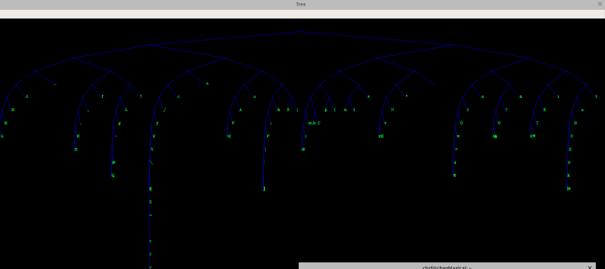

# Huffman编解码实验报告

**PB17050948        陈文博** 

## 问题描述

1. 对文本文件统计各个字符的出现频率，构造Huffman树。

2. 以图形化的方式打印Huffman树，例如可以逆时针旋转90度打印，如下图所示，或者自己设计打印图形。

   

3. 以Huffman树对文本文件进行编码，统计编码后的比特数，除以8得到字节数。用原文件的大小（字节数）除以编码后的字节数，即求得压缩比。

4. 将编码后的比特流再进行解码，写入一个新的文本文件，与原文件比较，是否完全一致？比较文件可使用Windows命令行工具fc。

## 实验内容 

### 1.结构体定义 

​	节点结构体：

```C++
  typedef struct Node{
    char data;
    int lchild;
    int rchild;
    int parent;
    int weight;
    std::string code="";
}Node;
```

​	结构体定义在Huffman.h文件中

### 2. 函数定义

程序Huffman.cpp中的函数包括：

**void Tree_Init(Node\*T);
void Count(Node\*T);
void Huffman(Node\*T);
void Create_Dict(Node\*T,int t,std::string code);
int Encode(Node\*T);
void Decode(Node\*T,int sum);
void Print_Tree(Node\*T);
void Print_Compress_Ratio();**

实现编解码和文件操作的功能

程序draw.py主要实现Huffman树可视化功能，main.cpp与draw.py之间的通信通过包含Huffman树信息的文件实现。

#### （1）void Tree_Init(Node \*T)

1. 函数功能：初始化Huffman树数组
2. 函数入口：Node结构体数组T
3. 算法流程：创建一个127*2-1空间大小的Node结构体数组，对T[i]，若i<127，则T[i].data赋值i，否则赋值128，权重全赋值为0，左孩子、右孩子和父母赋值-1
4. 算法分析：时间复杂度O（n），空间复杂度O（n）   

#### （2）void Count(Node\*T)

1. 函数功能：统计文件里各个字符出现的次数并赋值叶子的权重
2. 函数入口：Node结构体数组T
3. 算法流程：读取文件stdio.h，遍历文件，当读取到的字符c时，以c的ASCII码i作为下标，进行T[i].weight++的操作
4. 算法分析：时间复杂度O（n），空间复杂度O（n）

#### （3） void Huffman(Node\*T)

1. 函数功能：生成Huffman树
2. 函数入口：Node结构体数组T
3. 算法流程：遍历T中有权重的所有元素，选取其中最小的两个无父母节点作为左右孩子，选取新无权重元素作为父母节点，赋值孩子、父母数据域，重复操作，直到T中无无权重的节点为止。
4. 算法分析：时间复杂度O（n^2），空间复杂度O（n）

#### （4） void Create_Dict(Node*T,int t,std::string code)

1. 函数功能：生成Huffman码
2. 函数入口：Node结构体数组T，当前节点位置t（初始为根节点下标，即127*2-2），已生成的Huffman码片段。
3. 算法流程：若T[t]是叶子节点，则赋值T[t].code=code；否则递归遍历左右子树，若遍历左子树，则code+=‘0’，若遍历右子树，则code+='1'。直到Huffman树生成。
4. 算法分析：时间复杂度O（n），空间复杂度O（n）

#### （5） int Encode(Node*T)

1. 函数功能：文件编码
2. 函数入口：Node结构体数组T
3. 返回值：文件中的总比特数
4. 算法流程：读取文件stodio.h，将每个字符替换为其Huffman码，生成文件stdio_encode_temp.txt，并统计stdio_encode_temp.txt中的字符总数sum，在stdio_encode_temp.txt中每八个字符合并转译为一个unsigned char型变量存入stdio_encode中，未满八个的用'0'补全填入。保存stdio_encode，删除stdio_encode_temp.txt，返回sum。
5. 算法分析：时间复杂度O（n），空间复杂度O（n） 

#### （6）void Decode(Node*T,int sum)

1. 函数功能：文件解码
2. 函数入口：Node结构体数组T，解码后字符总数sum
3. 算法流程：遍历文件stdio_encode,将得到的每个字符转译为8个'0'和'1'构成的字符串，存入stdio_decode_temp.txt，最后一个，按照sum%8取字符。遍历stdio_decode_temp.txt，遍历Huffman树，得到相应的data，写入stdio_decode.txt，得到解码文件，删除stdio_decode_temp.txt。
4. 算法分析：时间复杂度O（n），空间复杂度O（n）

#### （7）void Print_Tree(Node*T)

1. 函数功能：打印Huffman树
2. 函数入口：Node结构体数组T
3. 算法流程：遍历T，打印T的所有信息，并生成含Huffman树ASCII码和Huffman码的文件Tree.txt
4. 算法分析：时间复杂度O（n），空间复杂度O（n） 

#### （8）void Print_Compress_Ratio()

1. 函数功能：打印压缩比
2. 函数入口：无
3. 算法流程：遍历stdio.h和stdio_encode文件，得到相应的比特数，打印比特数之比
4. 算法分析：时间复杂度O（n），空间复杂度O（n） 

#### （9）draw.py

该Python脚本主要实现Huffman树的可视化，调用opencv和os模块

**基本算法思想：**

读取Tree.txt文件，将文件信息填入列表T，规定窗口宽和高width、height，对于Huffman码为
$$
x_1x_2……x_n
$$
的叶子，可以算出它在
$$
第n+1层，从左往右数第\sum^n_{x=1}x_k*2^{n-k}个
$$
又第i层元素个数：
$$
N=2^i
$$
可得第h层、第n个节点坐标应为：
$$
(h*height/deep, 2*n*width/2^i)
$$
通过opencv库绘图函数实现绘制

### 3. 实验结果

函数运行后打印的T数组与压缩比：

```
0  data=  code=010000000000001  lchild=-1  rchild=-1  weight=0  parent=158
1  data=  code=0100000000000001  lchild=-1  rchild=-1  weight=0  parent=157
2  data=  code=01000000000000001  lchild=-1  rchild=-1  weight=0  parent=156
3  data=  code=010000000000000001  lchild=-1  rchild=-1  weight=0  parent=155
4  data=  code=0100000000000000001  lchild=-1  rchild=-1  weight=0  parent=154
5  data=  code=01000000000000000001  lchild=-1  rchild=-1  weight=0  parent=153
6  data=  code=010000000000000000001  lchild=-1  rchild=-1  weight=0  parent=152
7  data=  code=0100000000000000000001  lchild=-1  rchild=-1  weight=0  parent=151
8  data  code=01000000000000000000001  lchild=-1  rchild=-1  weight=0  parent=150
9  data=	  code=110101  lchild=-1  rchild=-1  weight=334  parent=222
10  data=
  code=00111  lchild=-1  rchild=-1  weight=495  parent=229
11  data=
           code=010000000000000000000001  lchild=-1  rchild=-1  weight=0  parent=149
12  data=
           code=0100000000000000000000001  lchild=-1  rchild=-1  weight=0  parent=148
  code=01000000000000000000000001  lchild=-1  rchild=-1  weight=0  parent=147
14  data=  code=010000000000000000000000001  lchild=-1  rchild=-1  weight=0  parent=146
15  data=  code=0100000000000000000000000001  lchild=-1  rchild=-1  weight=0  parent=145
16  data=  code=01000000000000000000000000001  lchild=-1  rchild=-1  weight=0  parent=144
17  data=  code=010000000000000000000000000001  lchild=-1  rchild=-1  weight=0  parent=143
18  data=  code=0100000000000000000000000000001  lchild=-1  rchild=-1  weight=0  parent=142
19  data=  code=01000000000000000000000000000001  lchild=-1  rchild=-1  weight=0  parent=141
20  data=  code=010000000000000000000000000000001  lchild=-1  rchild=-1  weight=0  parent=140
21  data=  code=0100000000000000000000000000000001  lchild=-1  rchild=-1  weight=0  parent=139
22  data=  code=01000000000000000000000000000000001  lchild=-1  rchild=-1  weight=0  parent=138
23  data=  code=010000000000000000000000000000000001  lchild=-1  rchild=-1  weight=0  parent=137
24  data=  code=0100000000000000000000000000000000001  lchild=-1  rchild=-1  weight=0  parent=136
25  data=  code=01000000000000000000000000000000000001  lchild=-1  rchild=-1  weight=0  parent=135
26  data=  code=010000000000000000000000000000000000001  lchild=-1  rchild=-1  weight=0  parent=134
27  data=  code=0100000000000000000000000000000000000001  lchild=-1  rchild=-1  weight=0  parent=133
28  data=  code=01000000000000000000000000000000000000001  lchild=-1  rchild=-1  weight=0  parent=132
29  data=  code=010000000000000000000000000000000000000001  lchild=-1  rchild=-1  weight=0  parent=131
30  data=  code=0100000000000000000000000000000000000000001  lchild=-1  rchild=-1  weight=0  parent=130
31  data=  code=01000000000000000000000000000000000000000001  lchild=-1  rchild=-1  weight=0  parent=129
32  data=   code=1011  lchild=-1  rchild=-1  weight=2137  parent=240
33  data=!  code=000000001  lchild=-1  rchild=-1  weight=18  parent=177
34  data="  code=0011000011  lchild=-1  rchild=-1  weight=14  parent=172
35  data=#  code=11010001  lchild=-1  rchild=-1  weight=120  parent=181
36  data=$  code=010000000000000000000000000000000000000000001  lchild=-1  rchild=-1  weight=0  parent=128
37  data=%  code=0100000000000000000000000000000000000000000001  lchild=-1  rchild=-1  weight=0  parent=127
38  data=&  code=11010000  lchild=-1  rchild=-1  weight=25  parent=181
39  data='  code=0111000001  lchild=-1  rchild=-1  weight=15  parent=174
40  data=(  code=100011  lchild=-1  rchild=-1  weight=273  parent=218
41  data=)  code=011111  lchild=-1  rchild=-1  weight=273  parent=216
42  data=*  code=10101  lchild=-1  rchild=-1  weight=461  parent=227
43  data=+  code=0011000010  lchild=-1  rchild=-1  weight=10  parent=172
44  data=,  code=001001  lchild=-1  rchild=-1  weight=219  parent=213
45  data=-  code=00110001  lchild=-1  rchild=-1  weight=48  parent=190
46  data=.  code=0010001  lchild=-1  rchild=-1  weight=106  parent=200
47  data=/  code=010001  lchild=-1  rchild=-1  weight=211  parent=211
48  data=0  code=1101001  lchild=-1  rchild=-1  weight=152  parent=207
49  data=1  code=10000001  lchild=-1  rchild=-1  weight=63  parent=193
50  data=2  code=01100001  lchild=-1  rchild=-1  weight=59  parent=191
51  data=3  code=001000001  lchild=-1  rchild=-1  weight=25  parent=179
52  data=4  code=1100000001  lchild=-1  rchild=-1  weight=16  parent=175
53  data=5  code=11000000001  lchild=-1  rchild=-1  weight=9  parent=169
54  data=6  code=0011000001  lchild=-1  rchild=-1  weight=12  parent=173
55  data=7  code=11000000000  lchild=-1  rchild=-1  weight=7  parent=169
56  data=8  code=1111000001  lchild=-1  rchild=-1  weight=17  parent=176
57  data=9  code=01000001  lchild=-1  rchild=-1  weight=39  parent=187
58  data=:  code=000000000  lchild=-1  rchild=-1  weight=18  parent=177
59  data=;  code=0111001  lchild=-1  rchild=-1  weight=121  parent=203
60  data=<  code=001000000  lchild=-1  rchild=-1  weight=21  parent=179
61  data==  code=110000001  lchild=-1  rchild=-1  weight=36  parent=184
62  data=>  code=01100000  lchild=-1  rchild=-1  weight=51  parent=191
63  data=?  code=010000000011  lchild=-1  rchild=-1  weight=4  parent=161
64  data=@  code=111100000001  lchild=-1  rchild=-1  weight=5  parent=165
65  data=A  code=011001  lchild=-1  rchild=-1  weight=228  parent=215
66  data=B  code=00100001  lchild=-1  rchild=-1  weight=46  parent=189
67  data=C  code=1000011  lchild=-1  rchild=-1  weight=135  parent=204
68  data=D  code=1111001  lchild=-1  rchild=-1  weight=158  parent=209
69  data=E  code=111001  lchild=-1  rchild=-1  weight=348  parent=223
70  data=F  code=0110001  lchild=-1  rchild=-1  weight=114  parent=202
71  data=G  code=00000001  lchild=-1  rchild=-1  weight=38  parent=186
72  data=H  code=10100001  lchild=-1  rchild=-1  weight=44  parent=188
73  data=I  code=110001  lchild=-1  rchild=-1  weight=333  parent=221
74  data=J  code=010000000010  lchild=-1  rchild=-1  weight=1  parent=161
75  data=K  code=11110000001  lchild=-1  rchild=-1  weight=9  parent=170
76  data=L  code=001101  lchild=-1  rchild=-1  weight=226  parent=214
77  data=M  code=0000001  lchild=-1  rchild=-1  weight=78  parent=197
78  data=N  code=101001  lchild=-1  rchild=-1  weight=215  parent=212
79  data=O  code=1100001  lchild=-1  rchild=-1  weight=144  parent=206
80  data=P  code=01110001  lchild=-1  rchild=-1  weight=62  parent=192
81  data=Q  code=00110000001  lchild=-1  rchild=-1  weight=6  parent=167
82  data=R  code=000001  lchild=-1  rchild=-1  weight=200  parent=210
83  data=S  code=011110  lchild=-1  rchild=-1  weight=229  parent=216
84  data=T  code=1110001  lchild=-1  rchild=-1  weight=157  parent=208
85  data=U  code=11110001  lchild=-1  rchild=-1  weight=77  parent=196
86  data=V  code=100000001  lchild=-1  rchild=-1  weight=32  parent=183
87  data=W  code=11100001  lchild=-1  rchild=-1  weight=75  parent=195
88  data=X  code=111100001  lchild=-1  rchild=-1  weight=38  parent=185
89  data=Y  code=010000001  lchild=-1  rchild=-1  weight=20  parent=178
90  data=Z  code=0100000000001  lchild=-1  rchild=-1  weight=1  parent=160
91  data=[  code=111100000000  lchild=-1  rchild=-1  weight=3  parent=165
92  data=\  code=0100000001  lchild=-1  rchild=-1  weight=10  parent=171
93  data=]  code=011100000001  lchild=-1  rchild=-1  weight=3  parent=164
94  data=^  code=0100000000000000000000000000000000000000000000  lchild=-1  rchild=-1  weight=0  parent=127
95  data=_  code=0001  lchild=-1  rchild=-1  weight=907  parent=238
96  data=`  code=00110000000  lchild=-1  rchild=-1  weight=5  parent=167
97  data=a  code=111101  lchild=-1  rchild=-1  weight=391  parent=224
98  data=b  code=1000010  lchild=-1  rchild=-1  weight=122  parent=204
99  data=c  code=01001  lchild=-1  rchild=-1  weight=453  parent=226
100  data=d  code=00001  lchild=-1  rchild=-1  weight=402  parent=225
101  data=e  code=0101  lchild=-1  rchild=-1  weight=1008  parent=239
102  data=f  code=00101  lchild=-1  rchild=-1  weight=484  parent=228
103  data=g  code=0011001  lchild=-1  rchild=-1  weight=107  parent=201
104  data=h  code=011101  lchild=-1  rchild=-1  weight=249  parent=217
105  data=i  code=11101  lchild=-1  rchild=-1  weight=826  parent=236
106  data=j  code=011100000000  lchild=-1  rchild=-1  weight=3  parent=164
107  data=k  code=11100000  lchild=-1  rchild=-1  weight=71  parent=195
108  data=l  code=100101  lchild=-1  rchild=-1  weight=279  parent=220
109  data=m  code=1000001  lchild=-1  rchild=-1  weight=126  parent=205
110  data=n  code=11011  lchild=-1  rchild=-1  weight=717  parent=235
111  data=o  code=01101  lchild=-1  rchild=-1  weight=515  parent=230
112  data=p  code=100010  lchild=-1  rchild=-1  weight=251  parent=218
113  data=q  code=010000000001  lchild=-1  rchild=-1  weight=2  parent=162
114  data=r  code=10011  lchild=-1  rchild=-1  weight=585  parent=233
115  data=s  code=11001  lchild=-1  rchild=-1  weight=623  parent=234
116  data=t  code=11111  lchild=-1  rchild=-1  weight=843  parent=237
117  data=u  code=100100  lchild=-1  rchild=-1  weight=257  parent=220
118  data=v  code=1010001  lchild=-1  rchild=-1  weight=93  parent=199
119  data=w  code=11000001  lchild=-1  rchild=-1  weight=68  parent=194
120  data=x  code=10100000  lchild=-1  rchild=-1  weight=42  parent=188
121  data=y  code=0100001  lchild=-1  rchild=-1  weight=88  parent=198
122  data=z  code=100000000  lchild=-1  rchild=-1  weight=31  parent=183
123  data={  code=011100000011  lchild=-1  rchild=-1  weight=3  parent=163
124  data=|  code=011100001  lchild=-1  rchild=-1  weight=27  parent=182
125  data=}  code=011100000010  lchild=-1  rchild=-1  weight=3  parent=163
126  data=~  code=01000000000001  lchild=-1  rchild=-1  weight=1  parent=159
127  data=�  code=  lchild=94  rchild=37  weight=0  parent=128
128  data=�  code=  lchild=127  rchild=36  weight=0  parent=129
129  data=�  code=  lchild=128  rchild=31  weight=0  parent=130
130  data=�  code=  lchild=129  rchild=30  weight=0  parent=131
131  data=�  code=  lchild=130  rchild=29  weight=0  parent=132
132  data=�  code=  lchild=131  rchild=28  weight=0  parent=133
133  data=�  code=  lchild=132  rchild=27  weight=0  parent=134
134  data=�  code=  lchild=133  rchild=26  weight=0  parent=135
135  data=�  code=  lchild=134  rchild=25  weight=0  parent=136
136  data=�  code=  lchild=135  rchild=24  weight=0  parent=137
137  data=�  code=  lchild=136  rchild=23  weight=0  parent=138
138  data=�  code=  lchild=137  rchild=22  weight=0  parent=139
139  data=�  code=  lchild=138  rchild=21  weight=0  parent=140
140  data=�  code=  lchild=139  rchild=20  weight=0  parent=141
141  data=�  code=  lchild=140  rchild=19  weight=0  parent=142
142  data=�  code=  lchild=141  rchild=18  weight=0  parent=143
143  data=�  code=  lchild=142  rchild=17  weight=0  parent=144
144  data=�  code=  lchild=143  rchild=16  weight=0  parent=145
145  data=�  code=  lchild=144  rchild=15  weight=0  parent=146
146  data=�  code=  lchild=145  rchild=14  weight=0  parent=147
147  data=�  code=  lchild=146  rchild=13  weight=0  parent=148
148  data=�  code=  lchild=147  rchild=12  weight=0  parent=149
149  data=�  code=  lchild=148  rchild=11  weight=0  parent=150
150  data=�  code=  lchild=149  rchild=8  weight=0  parent=151
151  data=�  code=  lchild=150  rchild=7  weight=0  parent=152
152  data=�  code=  lchild=151  rchild=6  weight=0  parent=153
153  data=�  code=  lchild=152  rchild=5  weight=0  parent=154
154  data=�  code=  lchild=153  rchild=4  weight=0  parent=155
155  data=�  code=  lchild=154  rchild=3  weight=0  parent=156
156  data=�  code=  lchild=155  rchild=2  weight=0  parent=157
157  data=�  code=  lchild=156  rchild=1  weight=0  parent=158
158  data=�  code=  lchild=157  rchild=0  weight=0  parent=159
159  data=�  code=  lchild=158  rchild=126  weight=1  parent=160
160  data=�  code=  lchild=159  rchild=90  weight=2  parent=162
161  data=�  code=  lchild=74  rchild=63  weight=5  parent=166
162  data=�  code=  lchild=160  rchild=113  weight=4  parent=166
163  data=�  code=  lchild=125  rchild=123  weight=6  parent=168
164  data=�  code=  lchild=106  rchild=93  weight=6  parent=168
165  data=�  code=  lchild=91  rchild=64  weight=8  parent=170
166  data=�  code=  lchild=162  rchild=161  weight=9  parent=171
167  data=�  code=  lchild=96  rchild=81  weight=11  parent=173
168  data=�  code=  lchild=164  rchild=163  weight=12  parent=174
169  data=�  code=  lchild=55  rchild=53  weight=16  parent=175
170  data=�  code=  lchild=165  rchild=75  weight=17  parent=176
171  data=�  code=  lchild=166  rchild=92  weight=19  parent=178
172  data=�  code=  lchild=43  rchild=34  weight=24  parent=180
173  data=�  code=  lchild=167  rchild=54  weight=23  parent=180
174  data=�  code=  lchild=168  rchild=39  weight=27  parent=182
175  data=�  code=  lchild=169  rchild=52  weight=32  parent=184
176  data=�  code=  lchild=170  rchild=56  weight=34  parent=185
177  data=�  code=  lchild=58  rchild=33  weight=36  parent=186
178  data=�  code=  lchild=171  rchild=89  weight=39  parent=187
179  data=�  code=  lchild=60  rchild=51  weight=46  parent=189
180  data=�  code=  lchild=173  rchild=172  weight=47  parent=190
181  data=�  code=  lchild=38  rchild=35  weight=145  parent=207
182  data=�  code=  lchild=174  rchild=124  weight=54  parent=192
183  data=�  code=  lchild=122  rchild=86  weight=63  parent=193
184  data=�  code=  lchild=175  rchild=61  weight=68  parent=194
185  data=�  code=  lchild=176  rchild=88  weight=72  parent=196
186  data=�  code=  lchild=177  rchild=71  weight=74  parent=197
187  data=�  code=  lchild=178  rchild=57  weight=78  parent=198
188  data=�  code=  lchild=120  rchild=72  weight=86  parent=199
189  data=�  code=  lchild=179  rchild=66  weight=92  parent=200
190  data=�  code=  lchild=180  rchild=45  weight=95  parent=201
191  data=�  code=  lchild=62  rchild=50  weight=110  parent=202
192  data=�  code=  lchild=182  rchild=80  weight=116  parent=203
193  data=�  code=  lchild=183  rchild=49  weight=126  parent=205
194  data=�  code=  lchild=184  rchild=119  weight=136  parent=206
195  data=�  code=  lchild=107  rchild=87  weight=146  parent=208
196  data=�  code=  lchild=185  rchild=85  weight=149  parent=209
197  data=�  code=  lchild=186  rchild=77  weight=152  parent=210
198  data=�  code=  lchild=187  rchild=121  weight=166  parent=211
199  data=�  code=  lchild=188  rchild=118  weight=179  parent=212
200  data=�  code=  lchild=189  rchild=46  weight=198  parent=213
201  data=�  code=  lchild=190  rchild=103  weight=202  parent=214
202  data=�  code=  lchild=191  rchild=70  weight=224  parent=215
203  data=�  code=  lchild=192  rchild=59  weight=237  parent=217
204  data=�  code=  lchild=98  rchild=67  weight=257  parent=219
205  data=�  code=  lchild=193  rchild=109  weight=252  parent=219
206  data=�  code=  lchild=194  rchild=79  weight=280  parent=221
207  data=�  code=  lchild=181  rchild=48  weight=297  parent=222
208  data=�  code=  lchild=195  rchild=84  weight=303  parent=223
209  data=�  code=  lchild=196  rchild=68  weight=307  parent=224
210  data=�  code=  lchild=197  rchild=82  weight=352  parent=225
211  data=�  code=  lchild=198  rchild=47  weight=377  parent=226
212  data=�  code=  lchild=199  rchild=78  weight=394  parent=227
213  data=�  code=  lchild=200  rchild=44  weight=417  parent=228
214  data=�  code=  lchild=201  rchild=76  weight=428  parent=229
215  data=�  code=  lchild=202  rchild=65  weight=452  parent=230
216  data=�  code=  lchild=83  rchild=41  weight=502  parent=231
217  data=�  code=  lchild=203  rchild=104  weight=486  parent=231
218  data=�  code=  lchild=112  rchild=40  weight=524  parent=232
219  data=�  code=  lchild=205  rchild=204  weight=509  parent=232
220  data=�  code=  lchild=117  rchild=108  weight=536  parent=233
221  data=�  code=  lchild=206  rchild=73  weight=613  parent=234
222  data=�  code=  lchild=207  rchild=9  weight=631  parent=235
223  data=�  code=  lchild=208  rchild=69  weight=651  parent=236
224  data=�  code=  lchild=209  rchild=97  weight=698  parent=237
225  data=�  code=  lchild=210  rchild=100  weight=754  parent=238
226  data=�  code=  lchild=211  rchild=99  weight=830  parent=239
227  data=�  code=  lchild=212  rchild=42  weight=855  parent=240
228  data=�  code=  lchild=213  rchild=102  weight=901  parent=241
229  data=�  code=  lchild=214  rchild=10  weight=923  parent=241
230  data=�  code=  lchild=215  rchild=111  weight=967  parent=242
231  data=�  code=  lchild=217  rchild=216  weight=988  parent=242
232  data=�  code=  lchild=219  rchild=218  weight=1033  parent=243
233  data=�  code=  lchild=220  rchild=114  weight=1121  parent=243
234  data=�  code=  lchild=221  rchild=115  weight=1236  parent=244
235  data=�  code=  lchild=222  rchild=110  weight=1348  parent=244
236  data=�  code=  lchild=223  rchild=105  weight=1477  parent=245
237  data=�  code=  lchild=224  rchild=116  weight=1541  parent=245
238  data=�  code=  lchild=225  rchild=95  weight=1661  parent=246
239  data=�  code=  lchild=226  rchild=101  weight=1838  parent=247
240  data=�  code=  lchild=227  rchild=32  weight=2992  parent=248
241  data=�  code=  lchild=228  rchild=229  weight=1824  parent=246
242  data=�  code=  lchild=230  rchild=231  weight=1955  parent=247
243  data=�  code=  lchild=232  rchild=233  weight=2154  parent=248
244  data=�  code=  lchild=234  rchild=235  weight=2584  parent=249
245  data=�  code=  lchild=236  rchild=237  weight=3018  parent=249
246  data=�  code=  lchild=238  rchild=241  weight=3485  parent=250
247  data=�  code=  lchild=239  rchild=242  weight=3793  parent=250
248  data=�  code=  lchild=243  rchild=240  weight=5146  parent=251
249  data=�  code=  lchild=244  rchild=245  weight=5602  parent=251
250  data=�  code=  lchild=246  rchild=247  weight=7278  parent=252
251  data=�  code=  lchild=248  rchild=249  weight=10748  parent=252
252  data=�  code=  lchild=250  rchild=251  weight=18026  parent=-1
Compression Ratio:1.46046

```

Huffman树可视化效果：



###  讨论与总结

本实验难点在与解决Huffman编码末尾字节未满8个以及Huffman树的可视化输出，本实验利用计数与C++调用Python脚本实现。算法简单，缺点是移植性差，依赖环境。

## 备注

实验使用电脑系统Linux-4.15.0-36-generic-x86_64-with-Ubuntu-18.04-bionic

编译器g++ ，Python版本：3.6.6


